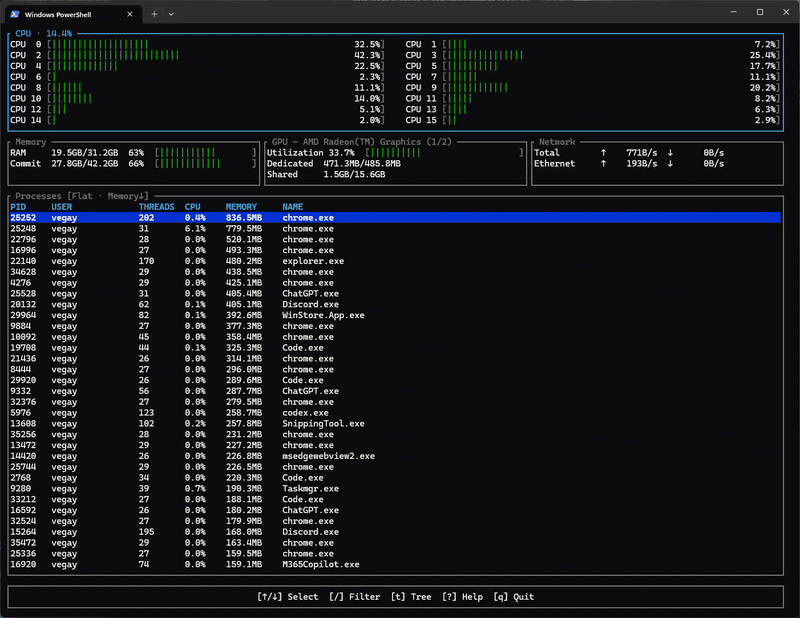

# wtop

> An interactive, htop-inspired system monitor for Windows terminals.

`wtop` brings a live process list and system-resource dashboard to PowerShell
and Windows Terminal. Inspect CPU, memory, commit, network, and GPU activity;
navigate process hierarchies; and filter, sort, or safely terminate processes
without leaving the command line.

---



---

## Features

- Live CPU, physical memory, Windows commit, network, GPU, and process data.
- Sortable, filterable process table with PID, user, thread count, CPU, memory,
  and process-name columns.
- Flat and collapsible parent/child process trees.
- Toggle between logical CPU meters and aggregate CPU history.
- Per-adapter GPU overview and detail panes when Windows exposes the counters.
- Eleven built-in color themes with live preview.
- Safe terminal cleanup, resize handling, and confirmed process termination.

## Quick start

### Requirements

- Windows with PowerShell or Windows Terminal
- The current stable Rust toolchain from [rustup](https://rustup.rs/)

### Run from a checkout

```powershell
cargo run
```

### Install locally

```powershell
cargo install --path .
wtop
```

Make sure Cargo's bin directory is on your `PATH` before running the installed
command.

## Keyboard controls

| Key | Action |
| --- | --- |
| `Up` / `Down` | Select the previous or next process |
| `Ctrl+Up` / `Ctrl+Down` | Move by one visible page |
| `Ctrl+Left` / `Ctrl+Right` | Select the first or last process |
| `c` | Toggle logical CPU meters and CPU history |
| `g` | Cycle GPU overview and adapter panes |
| `t` | Toggle flat and tree process views |
| `Enter` / `Space` | Expand or collapse the selected tree node |
| `/` | Edit the live filter (`Ctrl+U` clears it) |
| `s` / `S` | Cycle the sort column / reverse its direction |
| `o` | Open Themes; preview with `Up`/`Down` |
| `x` | Request termination of the selected process; confirm with `y` |
| `?` or `h` | Open Help |
| `q` or `Ctrl+C` | Quit |

Themes include Default, Monochromatic, Black on White, Light Terminal, MC,
Black Night, Broken Gray, Nord, Ocean, Evergreen, and Dusk. Theme selection is
currently per session.

## Notes

`Mem` is physical memory used versus total memory. `Commit` is the Windows
commit charge versus its limit, not Linux-style swap usage.

Windows protects some system and elevated processes. Process command lines,
owner information, GPU counters, and termination permissions are best-effort;
unavailable values are not presented as zero. wtop requires confirmation before
requesting termination and will not target PID 0, PID 4, or itself.

## Development

```powershell
cargo fmt --check
cargo test
cargo clippy -- -D warnings
cargo build --release
```

The release executable is written to `target\release\wtop.exe`.
